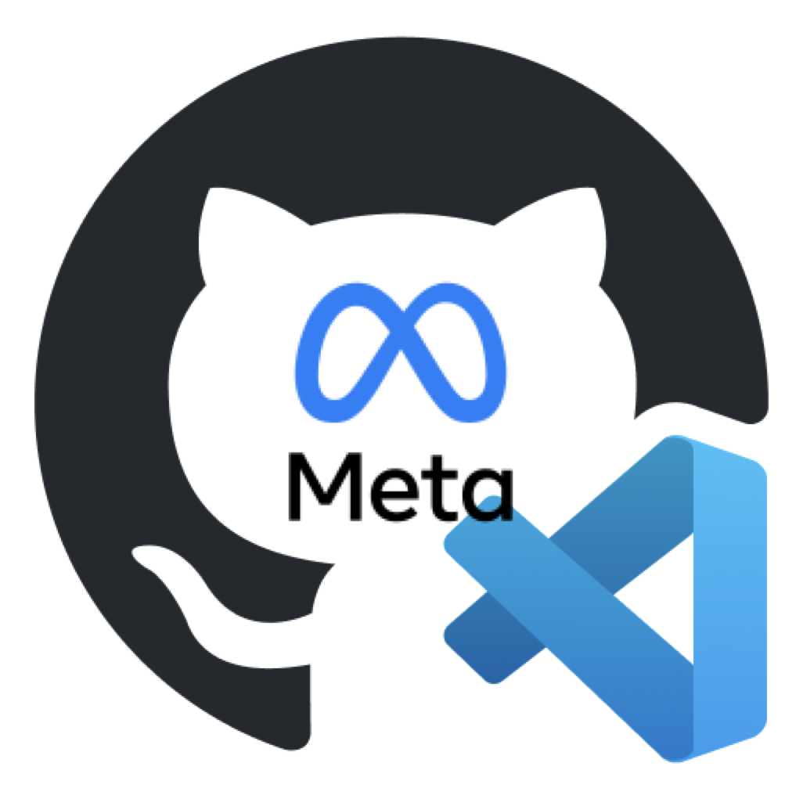

# META AI with LLAMA3 from Codespaces

- Dare to dream
- Ignite your inspiration and innovation
- Strive for excellence
- Explore together & unlock the world's knowledge

## Launching META AI with LLAMA3 from Codespaces.

## To launch META AI with LLAMA3 from Codespaces, follow these instructions:

### 1. Access GitHub Codespaces:

- Make sure you have a GitHub account. If not, you can sign up for free at https://github.com/join.

- Navigate to the GitHub repository META AI with LLAMA3 from Codespaces at https://github.com/ubc-tuehoang/META-AI-with-LLAMA3-from-Codespaces/tree/main.

### 2. Open Codespaces:

- In the GitHub repository, click on the "Code" button and select "Open with Codespaces" from the dropdown menu.

- Please ensure that the machine type has a minimum of 8 cores and 32GB RAM, ideally 64GB 

- If you don't see this option, the repository might not support Codespaces or you might not have permission to access it.

### 3. From Codespaces:

- Access the terminal and execute the following Docker build commands:
- 1. > docker build -t meta_ai_image . 
- 2. > docker run -it meta_ai_image /bin/bash
- 3. From the Terminal, launch ollama with command
-       3.1. > ollama serve
- 4. Create another Terminal, to access and launch META AI LLAMA3
-       4.1 > ollama run llama3

- 5. Communicate with META AI LLAMA3

_Example prompt 1: What is gaba receptor?_

- 6. An example of the next prompt:

_Example prompt 2: Considering this information, what steps can be taken to enhance mental well-being_

